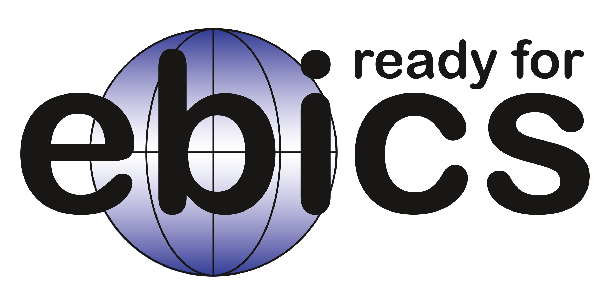

<div align="center">
	
	<h2>ALYF Banking</h2>
</div>

<div align="center">
<p><b>ALYF Banking</b> is a seamless solution for connecting your bank accounts with ERPNext.</p>

<p>This app is designed to simplify your financial management by effortlessly fetching transactions from thousands of banks and integrating them directly into your ERPNext system. Say goodbye to manual data entry and time-consuming reconciliations ✨</p>

<p>Experience the ease of automation and gain better control over your finances with the ultimate banking integration app for ERPNext users.</p>
</div>

<hr>
<b>Note</b>: Our improved Bank Reconciliation Tool is <b>free</b> to use and compatible with other bank integrations. The Bank Integration works with a paid subscription. Visit <a href="https://banking.alyf.de/banking-pricing">banking.alyf.de</a> to check out the pricing and sign up.
<hr>

## Documentation
Check out the [Banking Wiki](https://github.com/alyf-de/banking/wiki) for a step-by-step guide on how to use the app.

## Country and Bank Coverage



We use the EBICS protocol which is widely supported by banks in the following countries:

- 🇦🇹 Austria
- 🇫🇷 France
- 🇩🇪 Germany
- 🇨🇭 Switzerland

## Installation

Install [via Frappe Cloud](https://frappecloud.com/marketplace/apps/banking) or on your local bench:

```bash
bench get-app https://github.com/alyf-de/banking.git
bench --site <sitename> install-app banking
```

If you want to use ebics on Apple Silicon, the runtime library must be signed manually:

```bash
# python3.11
sudo codesign --force --deep --sign - env/lib/python3.11/site-packages/fintech/runtime/darwin/aarch64/pyarmor_runtime.so

# python3.10
sudo codesign --force --deep --sign - env/lib/python3.10/site-packages/fintech/pytransform/platforms/darwin/aarch64/_pytransform.dylib
```
